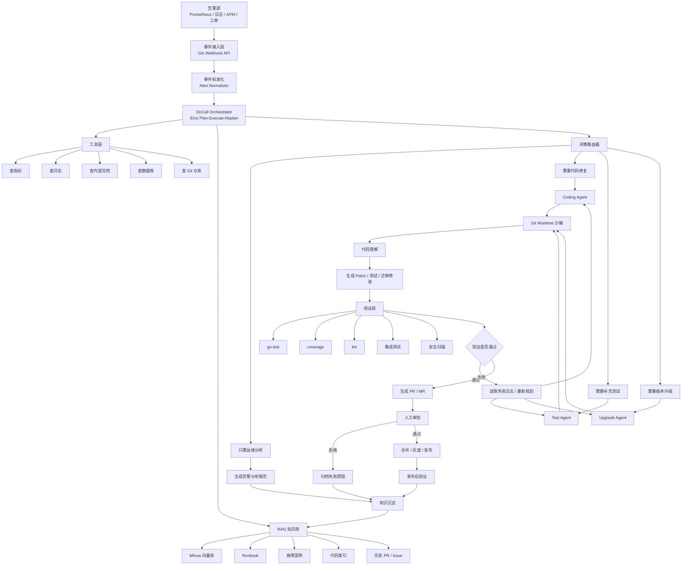
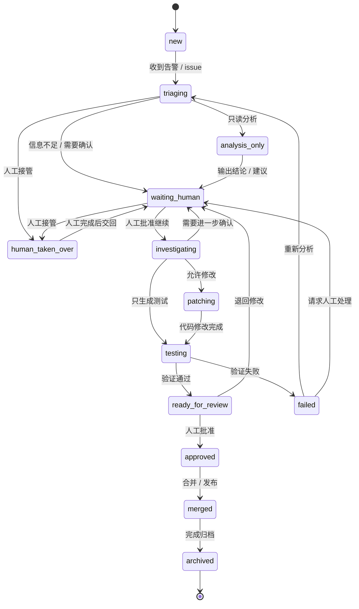
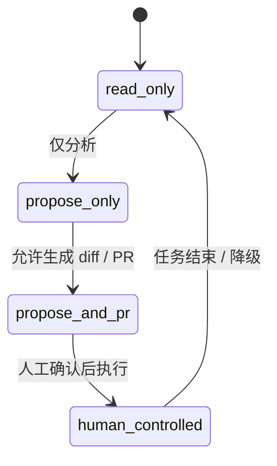

# Autonomous OnCall Coding Agent

一个面向告警、代码问题和版本升级的自主协作 Agent 系统。

它的目标不是一上来就全自动修复，而是先把“告警进入系统后的分析、研判、证据收集、人工接管、后续修复”这条链路打通，再逐步扩展到自动补测试、自动修复和升级迁移。

## 项目目标

- 自动接收告警
- 自动完成初步研判
- 自动收集日志、指标、文档和历史案例
- 自动输出处置建议
- 支持只读分析模式
- 支持人工接管
- 支持接入现有 coding agent
- 支持后续自动补测试、自动修复、版本升级

## 第一阶段范围

第一阶段先做 `OnCall Agent`，重点是：

- 告警接入
- 告警归一化
- 证据收集
- 根因分析
- 输出分析报告
- 人工接管入口
- 预留 GitHub / Repo 接入能力
- 预留 coding agent 扩展能力

## 总体架构



## 状态机

### 任务状态机



### 执行模式



## 核心模块

- `OnCall Agent`
    - 负责告警分析、证据收集、处置建议

- `Knowledge Retrieval`
    - 负责 runbook、历史案例、PR、代码索引检索

- `Repo Provider`
    - 负责 GitHub、GitLab、Gitea 等仓库接入

- `Coding Agent Adapter`
    - 负责对接现有或未来的 coding agent

- `Execution Sandbox`
    - 负责 worktree、命令执行、测试验证和回滚

- `Test Agent`
    - 负责自动补测试

- `Upgrade Agent`
    - 负责依赖升级和迁移辅助

- `Human Approval Gate`
    - 负责人工审批和人工接管

## 可扩展接入

系统会优先抽象为可插拔 adapter，后续可以扩展：

- 告警源接入
- Git 仓库接入
- coding agent 接入
- LLM 接入
- 执行沙箱接入
- 审批渠道接入
- 结果归档接入

## 技术栈

- Go
- Gin
- Eino
- Milvus
- GitHub API / GitLab API
- git worktree
- AST / `go/parser`
- Docker 或 Kubernetes Job
- Redis
- PostgreSQL 或 MySQL
- Prometheus
- OpenTelemetry

## 设计原则

- 先模块化单体，后按需拆分
- 所有写操作都必须经过沙箱
- 所有高风险动作都要保留人工接管
- 所有执行器都要可插拔
- 所有分析都要尽量给出证据来源
- 系统要同时支持“只分析不执行”和“提 PR 但人工审核”

## 第一阶段成功标准

- 告警来了以后，系统能自动完成大部分排障信息收集
- 系统能输出可读、可追溯的分析报告
- 系统能明确给出是否需要人工介入
- 系统能预留后续接入 coding agent 的路径
- 系统能进入 GitHub / PR 驱动的修复流程

## 说明

第一阶段先专注于 `OnCall Agent`，先把“发现问题到形成决策”的链路做稳，再逐步扩展到自动补测试、自动修复和升级迁移。
```